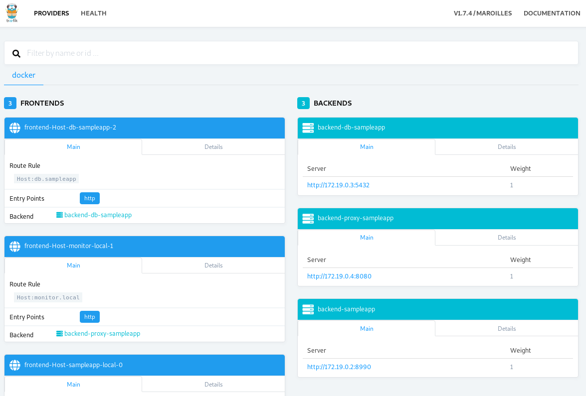

# Python to Docker
A shell script for dockerizing a python django project.

## Prerequisites
* Install Docker Toolbox for Windows https://docs.docker.com/toolbox/overview/
* Install Docker for Ubuntu https://docs.docker.com/install/linux/docker-ce/debian/
* On Linux you need to install `docker-compose` also.

Requirements
===========

* Docker 18.06.1-ce
* Docker Compose 1.23.1

We must **add virtual domains** in order to use each **api entry point**. By default we are using: 
**sampleapp.local** and **monitor.local**

**Virtual domains** has been defined in `docker-compose.yml` file and configured in `/etc/hosts` file. Add the 
following line in your `/etc/hosts` file:

```
127.0.0.1   sampleapp.local monitor.local
```

**monitor.local** will be used to see the Dashboard created by Traefik.


## Usage

To dockerize a django project you need to run the following command:
```
./python2docker.sh {ProjectFolder}
```
Where {ProjectFolder} is the location of your django project e.g. /home/siberiaodens/django-project

As an example you can use the sampleapp directory that is provided with this repository.

If using your own project make sure the following is set in your `settings.py`:
```
...
# SECURITY WARNING: don't run with debug turned on in production!
DEBUG = True
# This can be used to toggle between your local testing db (db.sqlite3) and the PostgreSQL backend:
DOCKER = True 
if DEBUG:
   # This value is not safe for production usage. Refer to the Django documentation for more information.
   ALLOWED_HOSTS = ['*']
...
...
# Database
# https://docs.djangoproject.com/en/2.1/ref/settings/#databases
if DOCKER:
    DATABASES = {
        'default': {
            'ENGINE': 'django.db.backends.postgresql',
            'NAME': 'postgres',
            'USER': 'postgres',
            'HOST': 'db',
            'PORT': 5432,
        }
    }
else:
    DATABASES = {
        'default': {
            'ENGINE': 'django.db.backends.sqlite3',
            'NAME': os.path.join(BASE_DIR, 'db.sqlite3'),
        }
    }
...
```

Traefik Dashboard
======================

Access to the dashboard to see how Traefik organize the links.

* http://monitor.local : Get Traefik dashboard



### Significant Revisions

* [Microservices - Martin Fowler](http://martinfowler.com/articles/microservices.html)
* [Traefik](https://traefik.io/)
